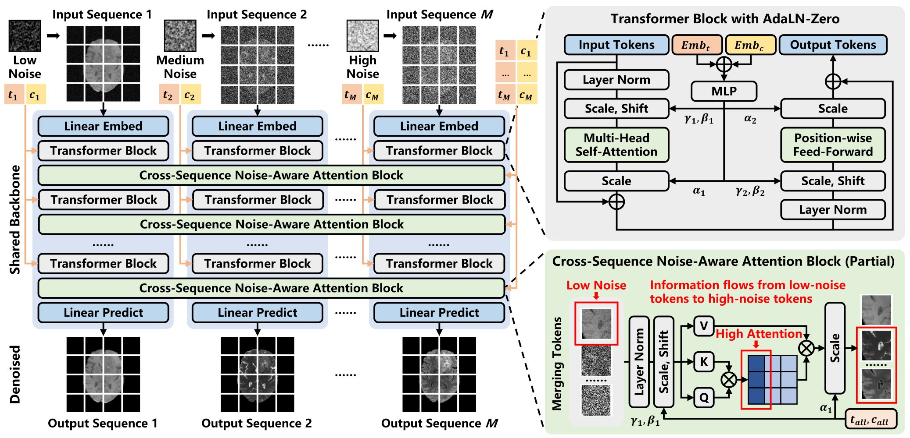
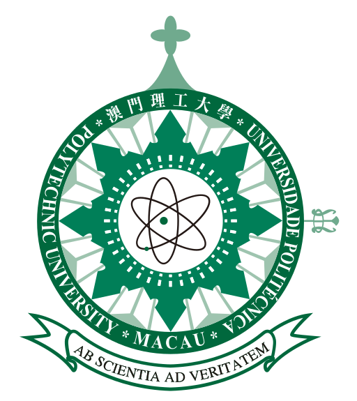
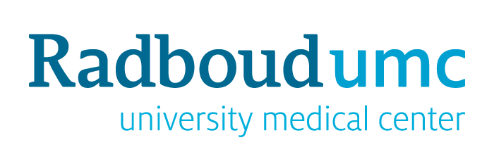

# AsynDiff: Asynchronous-Timestep Diffusion with Noise-Aware Attention for Multi-Sequence MRI Synthesis


<p align="center">

<p>

> [**AsynDiff: Asynchronous-Timestep Diffusion with Noise-Aware Attention for Multi-Sequence MRI Synthesis**](https://arxiv.org/abs/xxxxxx)<br>
> [Luyi Han](https://fiy2W.github.io/), Pengxiang Min, Xinghe Xie, Tianyu Zhang, Xin Wang, Yuan Gao, Chunyao Lu, Xinglong Liang, Yaofei Duan, Antonio Portaluri, Nika Rasoolzadeh, Jarek van Dijk, Muzhen He, Yue Sun, Chan-Tong Lam, Ritse Mann, Tao Tan
> <br>MPU, Radboudumc, NKI<br>

## 🔥 Update
- [2026.06.25] Codes are released!

## 🌿 Introduction
We introduce AsynDiff, a new diffusion framework for multi-sequence MRI completion that encodes the observed-missing asymmetry inside the diffusion process. By inducing inter-sequence noise disparities, AsynDiff enables reliable guidance from low-noise observed sequences to high-noise missing targets. We further reexamine cross-sequence information fusion under unequal noise and propose noise-aware attention to emphasize dependable features while suppressing noisy cues adaptively.

## 🚀 How to get started?
Read these:
- [Installation instructions](docs/installation_instructions.md)
- [Dataset conversion](docs/dataset_format.md)
- [Usage instructions](docs/how_to_use_nnseq2seq.md)

## 🔗 Citation
If you find our work useful for your research and applications, please cite using this BibTeX:

```bib
Coming soon!
```

## 🙏 Acknowledgements

<span>



</span>

## ✉️ Contact
For any code-related problems or questions please [open an issue](https://github.com/fiy2W/AsynDiff/issues/new) or concat us by emails.

- Luyi.Han@radboudumc.nl (Luyi Han)
- taotan@mpu.edu.mo (Tao Tan)